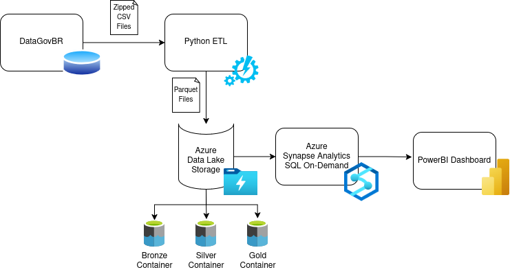

# AEB Data Analytics

This repository contains analytics and data engineering projects built on top of **public datasets published by AEB (Brazilian Space Agency)**.
The project focuses on data ingestion, transformation, modeling, and visualization, using modern cloud-based data architecture and analytics tools.

It includes Python-based ETL pipelines, curated datasets, and analytical models designed to support data exploration, reporting, and business intelligence use cases.

## Objectives

- Ingest and process open data published by AEB and the Brazilian Government
- Apply data engineering best practices (ETL, data modeling, layered data lake)
- Build analytical datasets optimized for BI and reporting
- Provide reusable pipelines and a scalable analytics architecture
- Enable data visualization and insights through Power BI

## Data Sources
All datasets used in this project are publicly available through the Brazilian Government Open Data Portal ([DataGovBR](https://dados.gov.br)).

**Projects and Programs**:
- [X] [Brazilian Space Objects](https://dados.gov.br/dados/conjuntos-dados/objetos-espaciais-brasileiro)
- [ ] [Brazilian Space Industry Catalog](https://dados.gov.br/dados/conjuntos-dados/catalogo-industria-espacial)
- [ ] [AEB Institutional Performance Evaluation Cycle](https://dados.gov.br/dados/conjuntos-dados/ciclo-de-avaliacao-de-desempenho-institucional-da-aeb)

**Budget and Human Resources**:
- [X] [AEB Open Budget Data](https://dados.gov.br/dados/conjuntos-dados/dados-abertos-de-orcamento-da-aeb)
- [ ] [AEB Public Procurement – PNCP](https://dados.gov.br/dados/conjuntos-dados/compras-publicas-da-aeb-pncp)
- [ ] [AEB Human Resources Open Data](https://dados.gov.br/dados/conjuntos-dados/dados-abertos-de-recursos-humanos-da-aeb)

## Data Architecture and Flow

The project follows a modern analytics architecture, from raw data ingestion to business intelligence consumption.

- **DataGovBR**:
  - Public datasets published by the Brazilian Government
  - File formats: CSV / ZIP
  - Source systems with no guaranteed schema consistency
- **Python ETL**:
  - Automated data extraction (HTTP download)
  - File decompression and parsing
  - Data cleaning and standardization
  - Type enforcement based on metadata
  - Data modeling (fact, dimension, and bridge tables)
- **Azure Data Lake Storage**:
  - Centralized cloud storage for all datasets
  - Layered architecture:
    - Bronze: Raw, immutable data 
    - Silver: Cleaned and standardized datasets 
    - Gold: Analytics-ready datasets (star schema)
  - Storage format: Parquet
- **Azure Synapse Analytics**:
  - Serverless SQL (on-demand) used for analytical queries
  - External tables and views over Parquet files
  - Logical data warehouse layer on top of the data lake
  - Optimized for BI consumption and ad-hoc analysis
- **Power BI**:
  - Semantic modeling and relationships
  - Star schema consumption
  - Interactive dashboards and analytical reports
  - DirectQuery or import mode from Azure Synapse

## Disclaimer

All datasets used in this repository are publicly available and provided by official Brazilian Government sources.
This project is intended for educational, analytical, and portfolio purposes.
